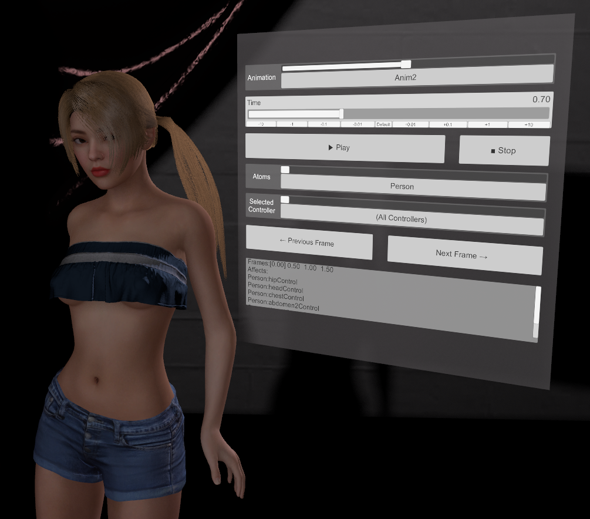
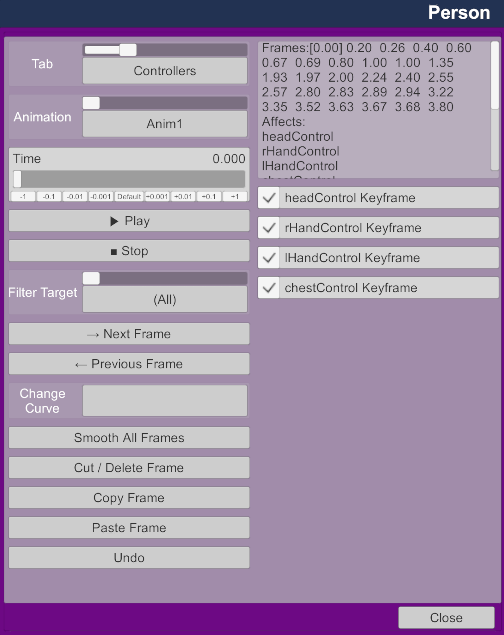
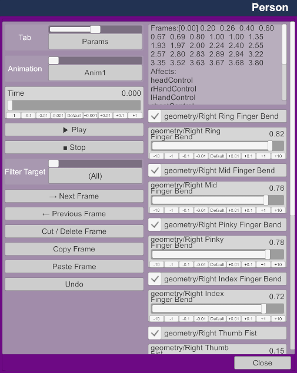

# Virt-A-Mate Timeline

An animation timeline with keyframe and controllable curves

## Features

- Animate controllers by creating frames for each controller and loop them
- Scrubbing, playback, and frame navigation
- Curve control
- Link to animation pattern
- Multiple animations and animation blending
- Cut, Copy, Paste
- Custom frame display
- External playback controller
- Sync multiple atom animations

## Installing

Download `VamTimeline.zip` from [Releases](https://github.com/acidbubbles/vam-timeline/releases) and extract it into `(VaM Install Folder)/Custom/Scripts/Acidbubbles/VamTimeline`.

## Basic Setup

It is expected that you have some basic knowledge of [how Virt-A-Mate works](https://www.reddit.com/r/VirtAMate/wiki/index) before getting started. Basic knowledge of keyframe based animation is also useful. In a nutshell, you specify some positions at certain times, and all positions in between will be interpolated using curves (linear, smooth, etc.).

### Your first animation

1. Add the `VamTimeline.AtomAnimation.cslist` plugin on atoms you want to animate, and open the plugin settings (`Open Custom UI` in the Atom's `Plugin` section).
2. In Animation Settings screen, select a controller you want to animate in the `Animate Controller` drop down, and select `Add Controller` to include it. This will turn on the "position" and "rotation" controls for that controller if that's not already done.
3. You can now select the `Controllers` tab by using the top-left drop-down. Your controller is checked, that means there is a keyframe at this time in the timeline.
4. To add a keyframe, move the `Time` slider to where you want to create a keyframe, and move the controller you have included before. This will create a new keyframe. You can also check the controller's toggle. Unchecking the toggle will delete that keyframe for that controller. Try navigating using the `Next Frame` and `Previous Frame` buttons, and try your animation using the `Play` button.
5. There is a text box on the top right; this shows all frames, and for the current frame (the current frame is shown using square brackets), the list of affected controllers. This is not as good as an actual curve, but you can at least visualize your timeline.

See below for screenshots, or check out this video walkthrough:

### Controller filtering

To allow moving between the frames of a specific controller instead of stopping at every frame of every controller, you canuse the `Filter Target` drop down. This will also make the `Change Curve`, `Cut`, `Copy` and `Paste` features only affect a single frame of a single controller, instead of all affected controller of that frame. Note that this will still allow you to move and create frames for other controllers.

### Curve options

You can choose what kind of tangent to apply on keyframes. This will change what the curve looks like. A flat curve will slow down to zero, and re-accelerate. A smooth curve will try to keep momentum between keyframes, and a linear curve will move in a straight line. The bounce curve accelerates, and bounces back at the same speed.

Keep in mind that the first and last frames will always be smooth to ensure correct looping. You cannot change this option.

By default, new keyframes will automatically select a smooth curve, but deleting a keyframe will not reset that curve. This can result in weird movements; you can use the `Smooth` curve type on those frames to reset them, or use `Smooth All Frames` to reset every keyframe to a smooth version.

### Multiple animations

You can add animations with `Add New Animation` button in the `Animatin Settings` tab. This will port over all controller positions from the _currently_ displayed keyframe, as well as the length of the current animation. Note that if you later add more controllers, they will not be assigned to all animations. This means that when you switch between animations, controllers that were not added in the second animation will simply stay where they currently are.

You can switch between animations using the `Animation` drop down. When the animation is playing, it will smoothly blend between animations during the value specified in `Blend Duration`.

Animation switching can be automated using the `Next Animation` setting.

Note that if you try to blend sequential animations in a way that overlap (e.g. Anim 1 transitions to Anim 2 in 1s, Anim 2 has a length of 1s, and Anim2 transitions to Anim 3 in .5s, this means that Anim 2's transition to Anim 3 will start before the transition from Anim 1 to Anim 2 has completed), you will get animation jumps.

### Animating morphs and other parameters

You can animate morphs and any other `float param`, such as light intensity, skin specular, etc. You can add them like controllers in the `Animation Settings` tab. Then, in the `Params` tab,  you can use the toggle to create keyframes, or use the sliders to change values and create keyframes at the current time.

### Performance

To gain a little bit of performance, you can use the `Locked` screen. It will reduce processing a little bit, and prevent moving controllers by accident.

### Triggering events

To use events, you can use an `AnimationPattern` of the same length as the animation. When an Animation Pattern is linked, it will play, stop and scrub with the VamTimeline animation.

### Adding an external playback controller

This allows creating a floating payback controller, and control multiple atoms together. Create a `Simple Sign` atom and add the script to it. This is optional, you only need this if you want to animate more than one atom, or if you want the floating playback controls.

Add the `VamTimeline.Controller.cslist` plugin on a `Simple Sign` atom.

In the plugin settings, select the animations you want to control and select `Link`.

You can now control the animations in the floating panel; you can also select which atom and animation to play.

Note that all specified atoms must contain the same animations, and animations must have the same length.

### Keyboard shortcuts

When the Controller Plugin has been added, you can use the left/right keyboard arrows to move between keyframes, up/down to move between filter targets, and spacebar to play/stop the animation.

### Interacting with scenes

Playing, stopping and otherwise interacting with this plugin is possible using storables. For example, you can play a specific animation when a mouth colliders triggers, or when an animation patterns reaches a certain point. This can create some intricate relationships between animations and interactivity.

### Sharing animations between atoms

You can use the Export function to use the animation on another atom. The receiving atom must already have the timeline plugin, and be of the same type. This will overwrite all animations.

Note that unless you have animated the `control` controller, the receiving atom will keep it's position, and the animation will be relative to it.

### Publishing without the plugin

You can bake the animation into the scene. Note that if you already have recorded elements, baking will not make the original animation longer. Also, only controllers will be baked, morphs are not yet supported.

### Screenshots

The settings screen allow configuring the animation.

The controllers screen provides tooling to help manage controller keyframes.

The Params screen allows provides tooling to animate morphs and other params.

### Known issues

- Some morphs conflict with each other. For example, the `Right Hand Grasp` controls the thumb, so the `Right Thumb Grasp` morphs will be ignored when the former is animated.

## Development

The paths to the VaM dll files are relative, so clone into `(VaM Install Folder)/Custom/Scripts/Dev/vam-timeline` for example.

When reloading a Virt-A-Mate script after it was modified externally, you will lose your data. For complex animations, it can be a frustrating workflow. Add the `VamTimeline.Backup.cslist` script on all atoms that have the `VamTimeline.AtomAnimation.cslist`.

This allows for reloading the main script without losing your data. Mosty useful for development. Add to atoms with VamTimeline.cslist. Unnecessary with normal use.

## License

[MIT](LICENSE.md)
